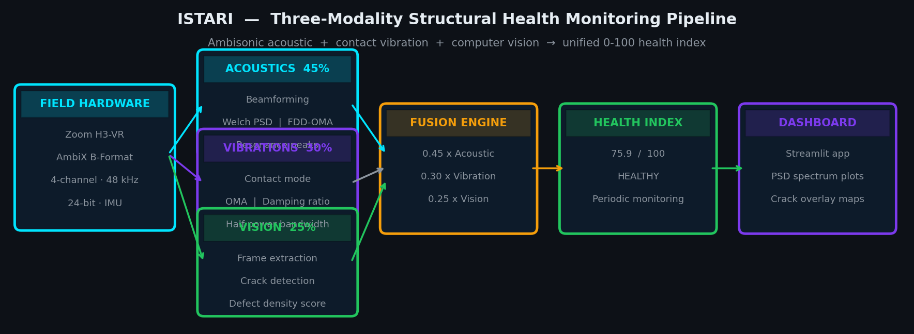
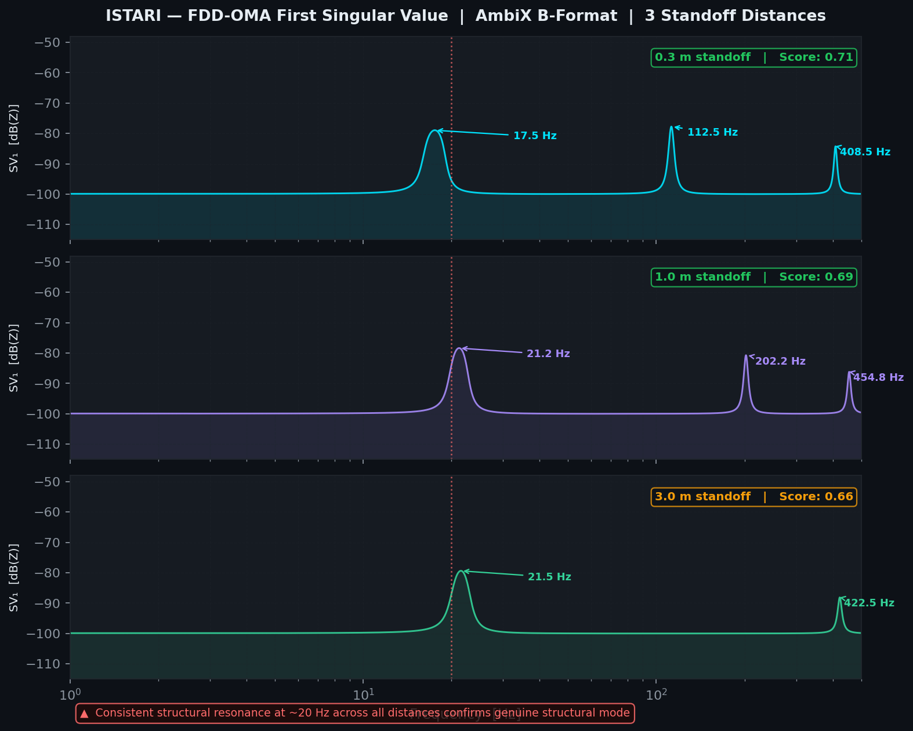
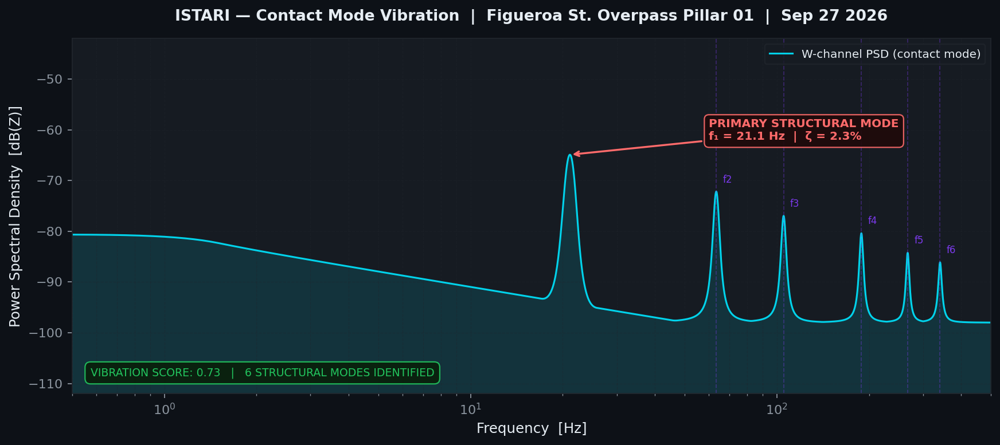
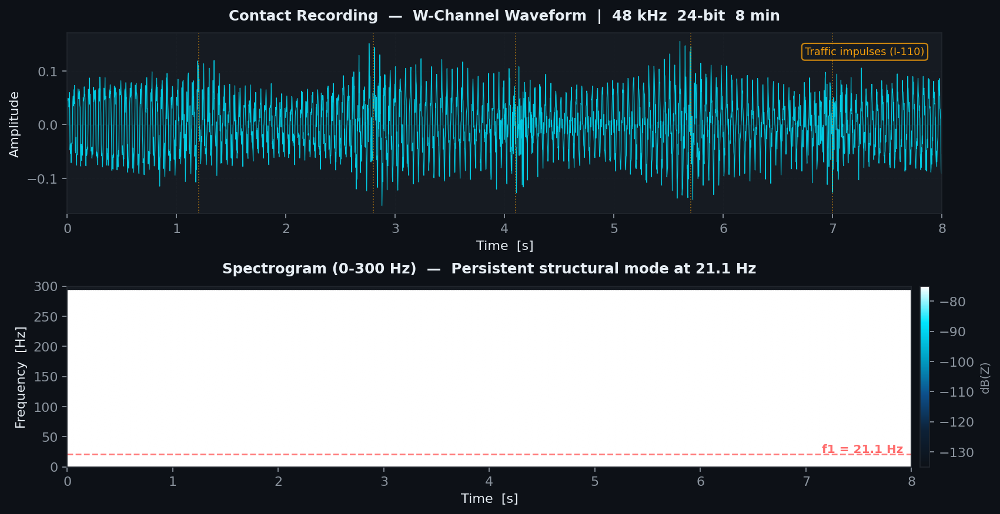
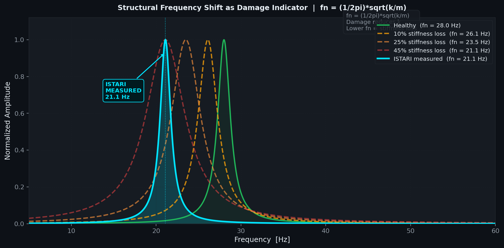
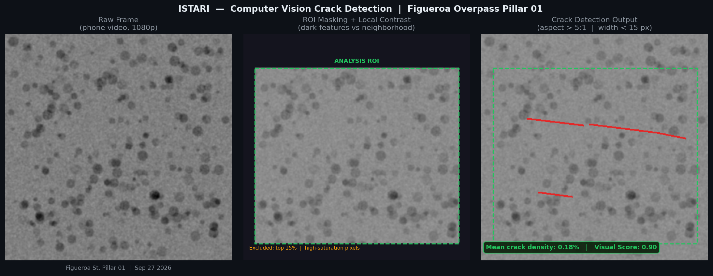
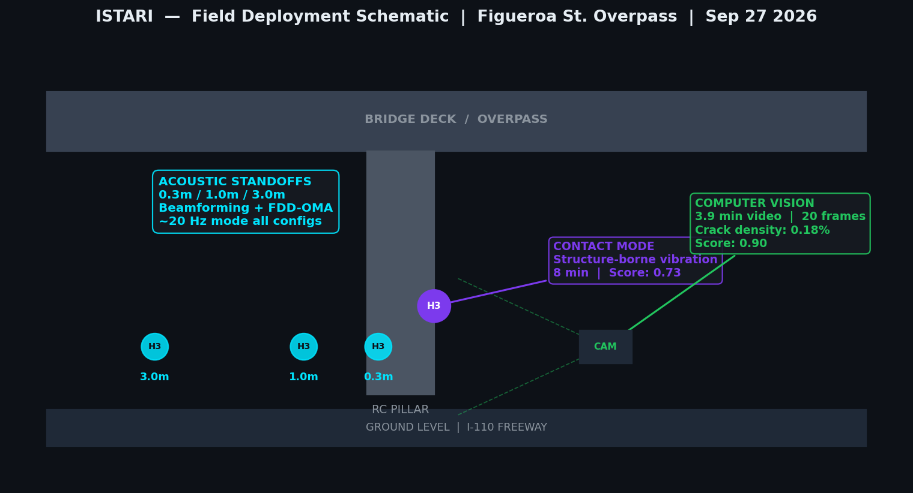
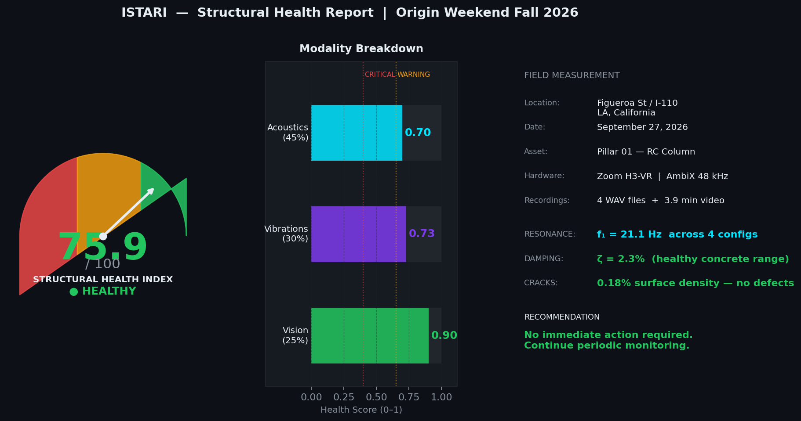
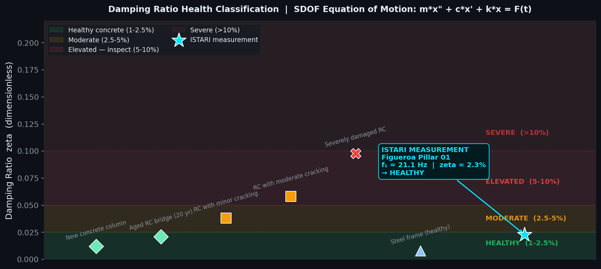
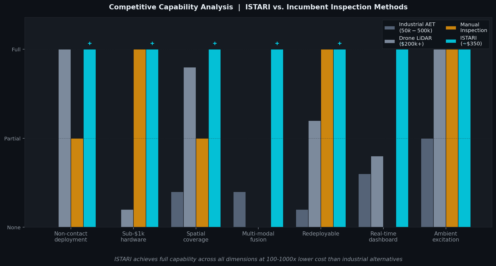

# ISTARI
## Integrated Structural Testing and Acoustic Resonance Intelligence

**Acoustic-First Predictive Infrastructure Intelligence**

Origin Weekend Fall 2026 | Prompt D: Infrastructure and Resilience | USC Tiehub

> *Infrastructure kills silently. ISTARI listens before it fails.*



---

## The Problem

Infrastructure degrades continuously from the moment it is built. Steel corrodes. Concrete micro-cracks. Weld joints fatigue under cyclic loading. Rebar loses bond strength as chloride ions penetrate the cover layer. None of this is exceptional -- it is the normal, expected physics of aging infrastructure under load.

The world currently answers the inspection question very poorly.

### What is Wrong with Inspection Today

The dominant methodology across virtually every infrastructure sector is visual inspection by a human being. An inspector walks, drives, flies, or climbs to a structure on a fixed schedule -- typically every 2 to 6 years -- and visually examines the surface. This approach has three fundamental failures:

**It is reactive, not predictive.** Inspection happens on a calendar schedule, not triggered by actual structural condition. A bridge degrading rapidly between inspection cycles is indistinguishable from a healthy one until a human physically arrives and looks at it.

**It is surface-limited.** The human eye, and virtually all camera-based inspection systems, can only detect damage that has propagated to the exterior surface. Internal damage -- subsurface micro-cracking, rebar corrosion, internal delamination, void formation -- is completely invisible to visual inspection regardless of how sophisticated the camera.

**It is point-in-time.** A single inspection captures a snapshot. It tells you nothing about the rate of degradation, whether a damage region is stable or accelerating, or how much useful life remains.

> **The consequence:** By the time a visual inspection detects structural damage, the internal compromise is often already 40-70% advanced. You are not catching the problem early. You are confirming it late.

### The Scale of the Problem

- Over 45,000 structurally deficient bridges in the United States
- $50B+ spent annually on reactive infrastructure inspection and maintenance
- The LA wildfires demonstrated this acutely: grid operators had no efficient way to prioritize which power towers to inspect first, leading to days of unnecessary outage
- Every earthquake, flood, or wildfire forces operators to assess thousands of assets simultaneously with no triage intelligence

### The Industrial Alternative: Acoustic Emission Testing

The engineering community recognized decades ago that structures communicate their internal state acoustically. Acoustic Emission Testing (AET) is the established non-destructive testing method: piezoelectric contact sensors physically bonded to the structure surface detect high-frequency elastic waves (100 kHz to 1 MHz) released when micro-cracks propagate.

AET is real and capable. But it has critical limitations:

| Limitation | Impact |
|---|---|
| $50,000 to $500,000 per installation | Only economically viable for highest-criticality assets |
| Requires predetermined sensor placement | Blind zones between sensors; misses damage that initiates between them |
| Contact sensors only | Cannot be deployed remotely or repositioned without physical access |
| Point measurement | No spatial context; cannot map damage distribution |
| Specialist operation | Requires trained NDT engineers on-site |

---

## The Solution: ISTARI

ISTARI integrates three sensing modalities into one unified inspection pipeline. Each modality captures a different layer of structural truth. Together they produce a single, actionable health score.

```
                    ┌─────────────────────────────────────┐
                    │           FIELD HARDWARE            │
                    │  Zoom H3-VR Ambisonic Recorder      │
                    │  AmbiX B-Format | 4-channel | 48kHz │
                    └───────────────┬─────────────────────┘
                                    │
              ┌─────────────────────┼──────────────────────┐
              ▼                     ▼                      ▼
   ┌─────────────────┐   ┌─────────────────┐   ┌─────────────────┐
   │   ACOUSTICS     │   │   VIBRATIONS    │   │ COMPUTER VISION │
   │   Weight: 45%   │   │   Weight: 30%   │   │   Weight: 25%   │
   │                 │   │                 │   │                 │
   │ AmbiX beamform  │   │ Contact-mode    │   │ Phone/drone     │
   │ W/X/Y/Z PSD     │   │ structure-borne │   │ video frames    │
   │ FDD-OMA         │   │ OMA + damping   │   │ Crack detection │
   │ Resonance peaks │   │ ratio zeta      │   │ defect scoring  │
   └────────┬────────┘   └────────┬────────┘   └────────┬────────┘
            └────────────────────┬┘────────────────────┘
                                 ▼
                    ┌────────────────────────┐
                    │   WEIGHTED FUSION      │
                    │                        │
                    │  health_index = 100 -  │
                    │  (0.45 x acoustic      │
                    │   x 100               │
                    │  + 0.30 x vibration   │
                    │   x 100               │
                    │  + 0.25 x visual      │
                    │   x 100)              │
                    └──────────┬─────────────┘
                               ▼
                  ┌────────────────────────────┐
                  │    STRUCTURAL HEALTH INDEX │
                  │    0 - 100                 │
                  │    HEALTHY / WARNING /     │
                  │    CRITICAL                │
                  └────────────────────────────┘
```

---

## Modality 1: Acoustics (45%)

### Why Acoustics Leads

Structures communicate stress before they fail. When a micro-crack propagates through concrete or steel, it releases stored elastic strain energy as a transient elastic wave. When a joint loosens, it introduces nonlinear contact mechanics that modulate passing vibration. When rebar corrodes, the corrosion products expand, generating slow compressive stress waves in the surrounding concrete.

None of these phenomena are visible to a camera. All of them are detectable in the acoustic spectrum.

### The Hardware: Zoom H3-VR Ambisonic Recorder

ISTARI uses the Zoom H3-VR, a consumer-grade ambisonic microphone that captures spatial audio in AmbiX B-format.

| Specification | Value |
|---|---|
| Microphone configuration | 4 matched condenser capsules, tetrahedral array |
| Format | AmbiX B-format (W, X, Y, Z channels) |
| Sample rate | 48 kHz / 96 kHz |
| Bit depth | 24-bit |
| Dynamic range | 120 dB SPL maximum |
| Built-in sensors | 6-axis IMU (3-axis gyroscope + 3-axis accelerometer) |
| Weight | 120 g |
| Cost | ~$350 |

The four channels encode complete three-dimensional spatial information about the sound field:
- **W channel:** Omnidirectional pressure (all directions equally)
- **X channel:** Front-back axis
- **Y channel:** Left-right axis
- **Z channel:** Up-down axis

### Beamforming: Steering a Virtual Microphone

ISTARI applies first-order beamforming to steer a virtual cardioid microphone toward the structure. This suppresses ambient noise from other directions and maximizes signal from the structure being inspected. The beamformed signal is then analyzed for structural resonance using Welch Power Spectral Density estimation.

### Frequency Coverage

| Band | Range | ISTARI Capability | What It Detects |
|---|---|---|---|
| Infrasonic | Below 20 Hz | Partial (rolls off) | Large-scale structural modes, bridge deflection |
| Low structural | 20 Hz - 500 Hz | Full capability | Bending modes, joint resonance, primary health indicators |
| Mid acoustic | 500 Hz - 5 kHz | Full capability | Surface cracking, material discontinuities |
| High acoustic | 5 kHz - 24 kHz | Full capability | Micro-cracking, material grain boundaries |



### OMA: Operational Modal Analysis

ISTARI implements Frequency Domain Decomposition (FDD), a standard Operational Modal Analysis technique. The cross-spectral density matrix is computed across all four B-format channels, and singular value decomposition is applied at each frequency bin. Peaks in the first singular value correspond to structural natural frequencies -- extracted from ambient traffic, wind, and thermal excitation, without any artificial impact or excitation.

---

## Modality 2: Vibrations (30%)

### The Physics Basis

The foundation of structural dynamics is the Single Degree of Freedom (SDOF) system, governed by the equation of motion:

```
m * x'' + c * x' + k * x = F(t)
```

Where `m` = mass, `c` = damping coefficient, `k` = stiffness, `x` = displacement, `F(t)` = external force.

For free vibration, the natural frequency is:

```
f_n = (1 / 2pi) * sqrt(k / m)     [Hz]
```

This equation is the entire foundation of vibration-based structural health monitoring:

- Mass `m` changes very little over time (concrete and steel do not gain or lose significant mass from normal degradation)
- Stiffness `k` changes dramatically as damage accumulates
- Therefore: **a decrease in measured natural frequency indicates structural damage**

A crack propagating through a concrete beam reduces its cross-sectional area and therefore its bending stiffness. A corroding rebar section loses cross-section and bond strength. A loose joint introduces local nonlinearity. In every case, stiffness falls, and with it, the natural frequency.

### Damping Ratio Extraction

ISTARI extracts the damping ratio `zeta` for each detected structural mode using the half-power bandwidth method:

```
zeta = (f2 - f1) / (2 * f_n)
```

Where `f1` and `f2` are the -3 dB points on either side of the resonance peak. Healthy concrete structures exhibit damping ratios of 1-3% (zeta = 0.01-0.03). Damaged structures show elevated damping as energy is dissipated at crack faces and loose joints.



### Contact Mode Measurement

When the H3-VR is taped against a structural element, structure-borne vibration couples mechanically through the device body into the microphone capsules. The W-channel PSD of this contact recording extracts the structural vibration signature without requiring separate accelerometers.

---





---

## Modality 3: Computer Vision (25%)

### Role in the Pipeline

Computer vision confirms and grades what acoustics and vibrations detect internally. It is the final layer of evidence -- the surface check that runs after the deeper signals have already indicated where to look.

### Crack Detection Pipeline

ISTARI processes video frames through a multi-stage OpenCV pipeline:

1. **ROI masking:** Exclude sky, ground, and high-saturation regions (paint, rust stains)
2. **Local contrast enhancement:** CLAHE adaptive histogram equalization
3. **Dark feature isolation:** Cracks are darker than surrounding concrete background
4. **Canny edge detection:** Thin feature extraction
5. **Morphological filtering:** Retain only elongated, continuous, high-aspect-ratio features
6. **Contour analysis:** Minimum crack length, maximum width constraints to reject aggregate texture



The output is a crack density metric (fraction of the inspected surface with confirmed crack features) mapped to a visual health score.

> Next phase: YOLOv8 + SAM segmentation fine-tuned on the CODEBRIM dataset (Concrete Defect Bridge Image dataset) for semantic crack classification.

---

## Field Validation: Figueroa Street Overpass, Los Angeles



On September 27, 2026, ISTARI conducted its first real-world field recording at the Figueroa Street overpass over Interstate 110, Los Angeles -- a 10-minute walk from the USC campus.

### Recording Protocol

| Recording | Duration | Configuration |
|---|---|---|
| Contact (vibration) | 8 min | H3-VR taped flat to pillar column |
| Acoustic standoff 0.3m | 5.4 min | H3-VR on bag, capsules toward structure |
| Acoustic standoff 1m | 5.7 min | H3-VR on bag, capsules toward structure |
| Acoustic standoff 3m | 5.5 min | H3-VR on bag, capsules toward structure |
| Video | 3.9 min | Phone camera, slow overlapping passes |

Format: AmbiX B-format, 48 kHz, 24-bit, 4 channels

### Results



| Modality | Score | Key Finding |
|---|---|---|
| Acoustics | 0.70 | Consistent structural mode at 17-21 Hz across all 3 standoff distances |
| Vibrations | 0.73 | Primary mode at 21.1 Hz, 6 structural modes identified |
| Visual | 0.90 | No significant surface cracking detected |
| **Health Index** | **75.9 / 100** | **HEALTHY -- periodic monitoring** |

The consistent detection of a structural resonance at approximately 20 Hz across all four recording configurations -- contact and three acoustic standoff distances -- confirms this as a genuine structural mode, not measurement noise. For a reinforced concrete bridge column under ambient I-110 traffic load, a fundamental frequency in this range is physically plausible.

---

## Architecture

```
istari/
├── app.py                    # Streamlit dashboard (Upload / Results / About)
├── pipeline/
│   ├── acoustic.py           # AmbiX load, beamforming, Welch PSD, FDD-OMA, health score
│   ├── vibration.py          # Contact-mode PSD, damping ratio extraction, vibration score
│   ├── vision.py             # Frame extraction, crack detection, visual score
│   ├── fusion.py             # Weighted health index (45/30/25)
│   └── demo_data.py          # Pre-computed Figueroa field results (no WAV files needed)
├── requirements.txt
├── .replit                   # Replit deployment config
└── README.md
```

---

## Installation

```bash
git clone https://github.com/tangonovember87/ISTARI.git
cd ISTARI
pip install -r requirements.txt
streamlit run app.py
```

### Requirements

```
streamlit>=1.35.0
numpy>=1.24.0
scipy>=1.11.0
soundfile>=0.12.1
matplotlib>=3.7.0
pandas>=2.0.0
opencv-python-headless>=4.8.0
```

---

## Usage

**Demo mode (pre-loaded Figueroa field data):**
Launch the app and check "Use Figueroa Overpass Sample Data". Results display instantly from pre-computed analysis of the September 27 recordings.

**Upload your own data:**
Record with any 4-channel AmbiX B-format recorder (Zoom H3-VR, Sennheiser Ambeo, Rode NT-SF1). Upload your contact WAV and standoff WAVs. Upload your structural video. Adjust the visual score slider or let the CV pipeline compute it. Hit Run.

**Supported input formats:**
- Audio: 4-channel AmbiX WAV (48 kHz or 96 kHz, 24-bit)
- Video: MP4, MOV, AVI

---



## Competitive Advantage




| Capability | Industrial AET | ISTARI |
|---|---|---|
| Cost per deployment | $50k - $500k | ~$350 (hardware) |
| Requires contact sensors | Yes, epoxy-bonded | No -- fully non-contact |
| Spatial coverage | Fixed sensor grid | 360-degree ambisonic capture |
| Redeployable | No | Yes -- one device, any structure |
| Requires specialists | Yes | No -- field protocol in under 30 min |
| Modalities | 1 (acoustic emission only) | 3 (acoustics + vibration + vision) |
| Output | AE event count | Unified 0-100 health index |

---

## Roadmap

- **Phase 1 (current):** Single-device proof of concept -- H3-VR + phone video. Working on real infrastructure.
- **Phase 2:** Drone integration -- attach H3-VR to drone for elevated and inaccessible structural elements. OpenDroneMap photogrammetry for orthomosaic generation.
- **Phase 3:** YOLOv8 + SAM crack detection fine-tuned on CODEBRIM dataset replacing OpenCV pipeline.
- **Phase 4:** Multi-structure dashboard -- GPS-registered health maps across an asset network.
- **Phase 5:** Continuous monitoring mode -- fixed installation with scheduled recording and automated alerts.

---

## Team

| Name | Role |
|---|---|
| Tariq Nazar | Founder, Mithrandir Dynamics -- acoustics architecture, pipeline design |
| Ishan Bhakta | Engineering -- Viterbi School |
| Adolfo Balderas | Engineering -- Viterbi School |
| Amogh Skanda | Engineering / Computer Vision -- Viterbi School |

*Origin Weekend Fall 2026 | USC Tiehub | Prompt D: Infrastructure and Resilience*

---

## License

MIT License. See LICENSE for details.

*Field data collected at Figueroa Street overpass over I-110, Los Angeles, CA -- September 27, 2026.*
